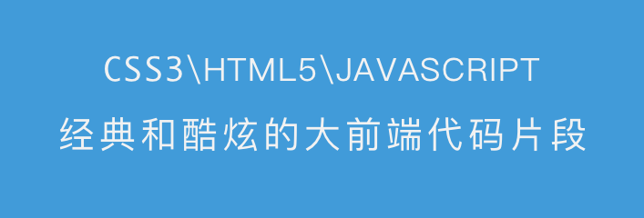
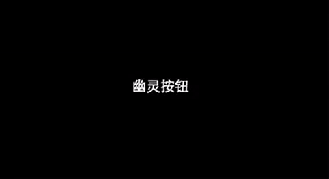
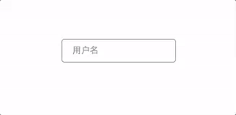
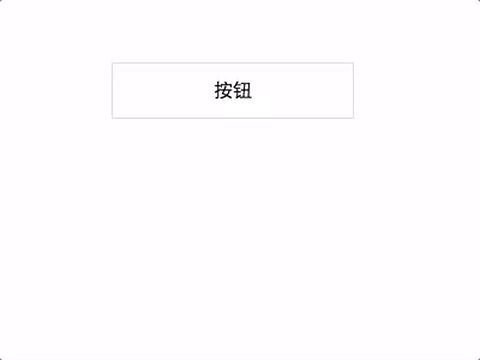

    

# web-code-snippet
> 收藏一些关于前端 [html、css、javascript] 的代码片段。

> 每日更新一个小片段，学无止境。

关于我，前端小鸟，一起学习进步。

## Example
- 2016-09-21 [幽灵按钮](./example/幽灵按钮/) Committer [@Gongchao](https://github.com/gongchao)

- 2016-09-21 [输入框标签](./example/输入框标签/) Committer [@Gongchao](https://github.com/gongchao)

- 2016-09-20 [涟漪按钮](./example/涟漪按钮/) Committer [@Gongchao](https://github.com/gongchao)

